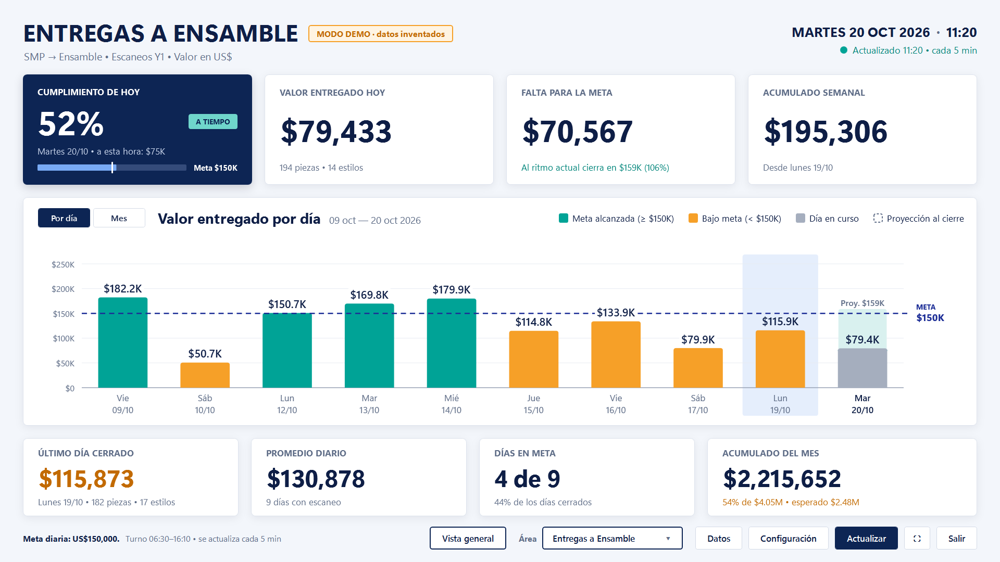
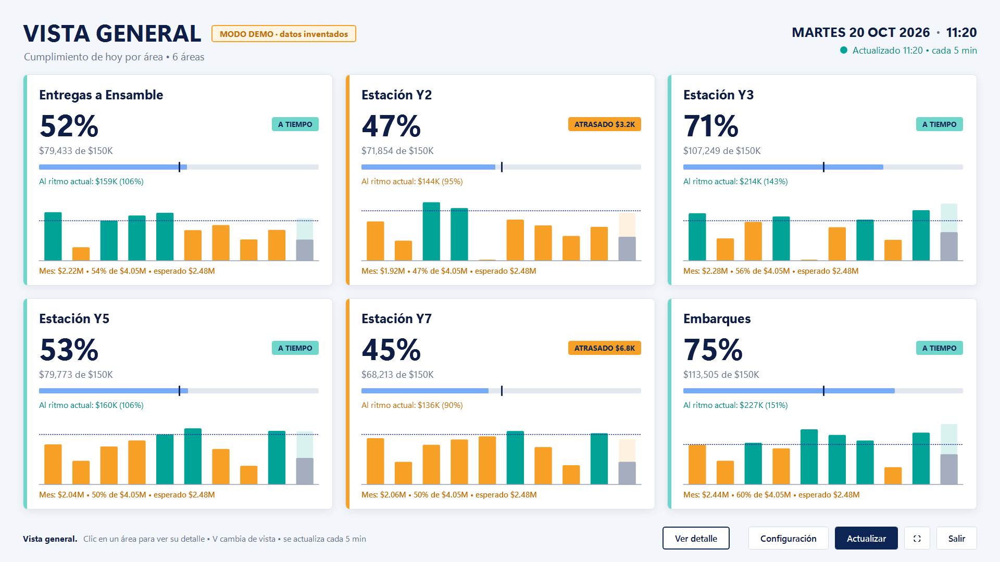
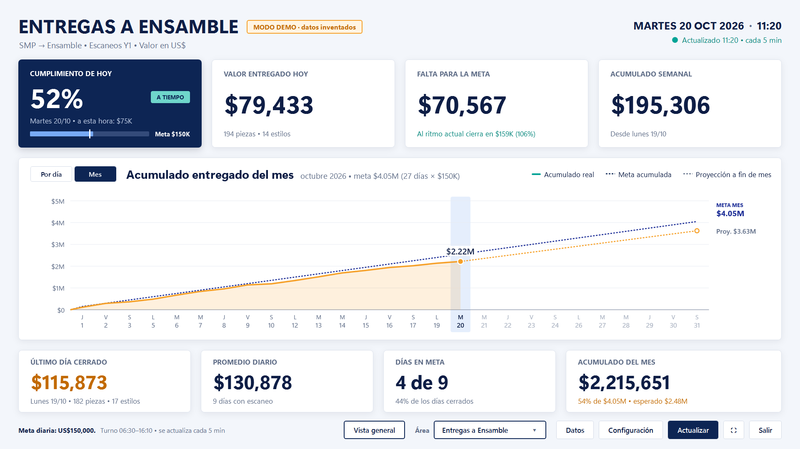
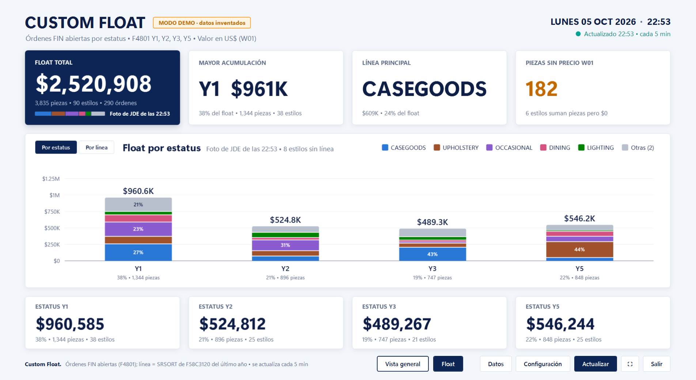
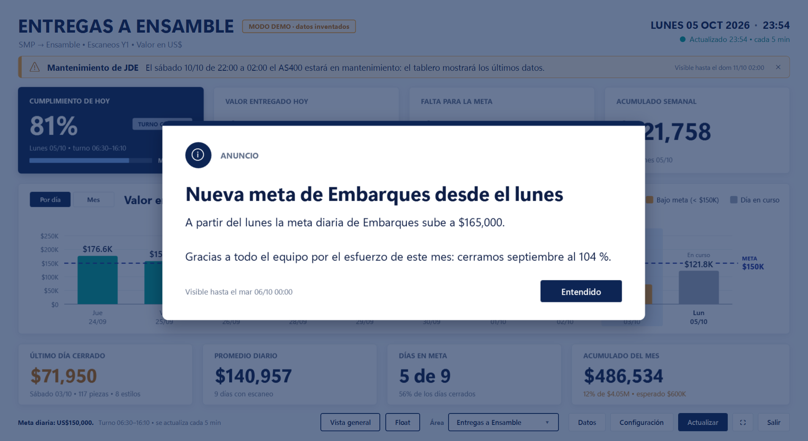
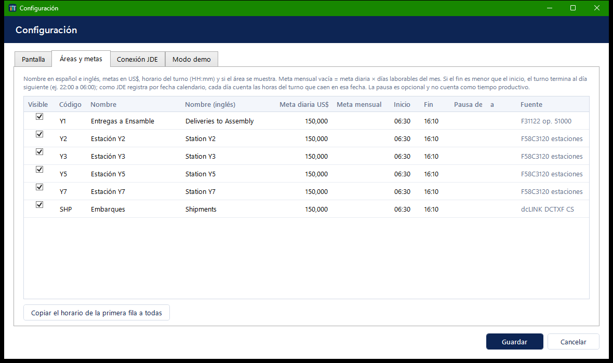
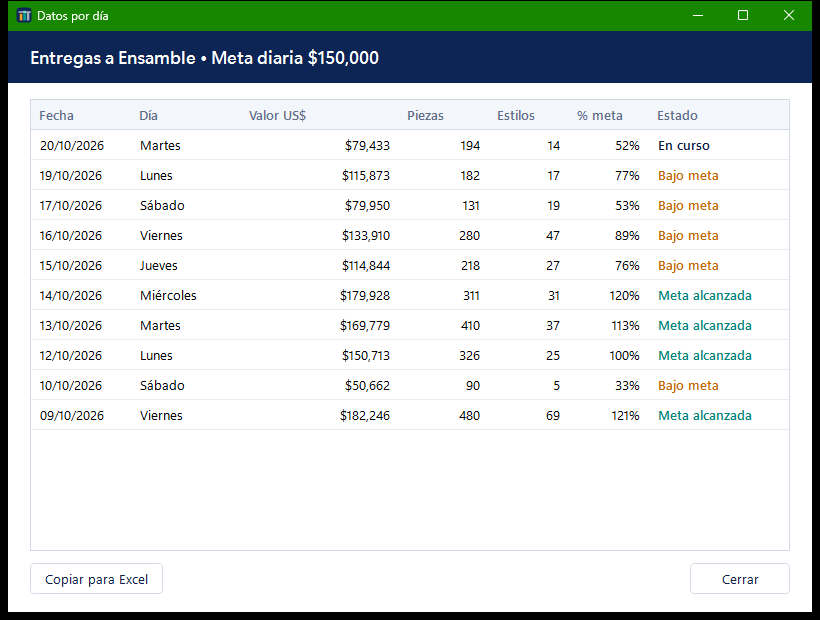

<div align="center">

# Dashboard Metas

### El avance de producción contra la meta, por área y en tiempo real, en la TV de la planta

[](LICENSE)
[](https://dotnet.microsoft.com/)
[](https://learn.microsoft.com/dotnet/desktop/wpf/)
[](#cómo-funciona)
[](#requisitos)

Aplicación de escritorio para Windows que consulta **JD Edwards World (AS400)** cada pocos minutos y muestra,
en pantalla completa, cuánto lleva cada área contra su meta diaria y mensual: si va **a tiempo o atrasada a esta
hora del turno**, dónde **cerrará el día al ritmo actual** y cómo va el **acumulado del mes**.



</div>

## Por qué

El tablero se armaba con un VBScript que generaba una base de Access con consultas *pass-through* a JDE. Funcionaba,
pero solo decía el porcentaje del día: a las 10 de la mañana «35 %» no dice si se va bien o mal. Tampoco había forma de
ver todas las áreas a la vez ni el avance del mes.

Dashboard Metas hace las mismas consultas en una aplicación propia y agrega lo que faltaba para decidir a tiempo:
la meta esperada a esta hora según el horario de cada turno (incluidos los que pasan la medianoche), la proyección al
cierre, la vista general de todas las áreas y el acumulado del mes contra su meta.

## Qué hace

| | |
| --- | --- |
| **Detalle de un área** | Cumplimiento de hoy, valor del día, falta o sobra para la meta, acumulado semanal, último día cerrado, promedio y días en meta |
| **Ritmo del turno** | «Esperado a esta hora» según el horario del área y etiqueta `A TIEMPO` / `ATRASADO $4K` / `META ALCANZADA` |
| **Proyección** | Dónde cierra el día al ritmo actual (en la tarjeta y como extensión punteada de la barra de hoy) |
| **Gráfica por día** | 5 a 31 días, color por cumplimiento, línea de meta, valor en cada barra y tooltip con el detalle |
| **Acumulado del mes** | Tarjeta con % de la meta mensual y esperado a la fecha, y gráfica del acumulado real contra la meta acumulada con proyección a fin de mes |
| **Vista general** | Todas las áreas en mosaico: cumplimiento, ritmo, proyección, mini-gráfica y mes. Clic para ver el detalle |
| **Turnos por área** | Horario y pausa por área, también turnos que pasan la medianoche (22:00 a 06:00) |
| **Siempre con datos** | Abre con los últimos datos guardados; si una consulta falla, esa área conserva sus datos y lo indica en rojo |
| **Para la TV** | Pantalla completa, escala a cualquier resolución, puntero oculto, cambio automático de área, español e inglés |
| **Sin ventanas inesperadas** | La actualización automática nunca abre diálogos; si falta la contraseña aparece un botón **Conectar** |
| **Custom Float** | Órdenes FIN abiertas por estatus (F4801) valuadas a W01: total, dónde se acumula, línea principal, piezas sin precio, y gráfica por estatus (apilada por línea de producto) o por línea |
| **Anuncios remotos** | Publicas un archivo firmado y las pantallas muestran el anuncio como tarjeta o franja, por fechas y por PC o planta. Nadie más puede publicar: solo se aceptan archivos firmados con tu clave |
| **Estado de las pantallas** | Cada pantalla reporta al panel si está encendida, qué muestra, si JDE responde, su versión y qué anuncios vio o cerró: ves desde el celular qué TV está caída y «visto en 5 de 6 pantallas» |
| **Control remoto** | Desde el panel: metas y turnos para todas las TVs, «mostrar el Float durante 30 min», actualizar datos, reiniciar la app y actualizaciones automáticas, todo firmado con tu clave |
| **Datos** | Tabla día por día, copiable a Excel; en el Float, estilo por estilo |
| **Diagnóstico** | Proceso de 32 bits, DSN y driver ODBC, y prueba de las cuatro consultas sin guardar nada |
| **Modo demo** | `--demo` corre todo sin AS400, con datos inventados, fallas simuladas y hora simulada |

## Cómo se ve

### Vista general



Cada mosaico resume un área: la franja de color es el ritmo (verde a tiempo, naranja atrasado, gris fuera de turno),
la línea vertical en la barra marca cuánto se esperaba a esta hora y la mini-gráfica muestra los últimos días.

### Acumulado del mes



Un solo eje: el acumulado real contra la meta acumulada (línea recta sobre los días laborables) y, desde hoy, la
proyección a fin de mes al ritmo actual.

### Custom Float



Lo que hay en proceso ahora mismo: las órdenes FIN abiertas en los estatus Y1, Y2, Y3 y Y5, valuadas a precio W01
(la misma consulta de `avanceMeta.vbs`). Cada barra es un estatus apilado por línea de producto; **M** cambia a una barra
por línea. La barra de la tarjeta azul es la misma composición por línea. Tecla **F** o botón **Float**; en el cambio
automático aparece después de la última área.

### Anuncios



Un anuncio «modal» aparece como tarjeta sobre el tablero; uno «banner» como franja bajo el título, que empuja el
contenido sin taparlo. Ver [Anuncios remotos](#anuncios-remotos).

### Configuración y datos

<table>
<tr>
<td width="58%"></td>
<td width="42%"></td>
</tr>
<tr>
<td><b>Áreas y metas</b> — nombres, meta diaria y mensual, turno y pausa</td>
<td><b>Datos</b> — el detalle día por día, copiable a Excel</td>
</tr>
</table>

> Las capturas son del **modo demo**: las cifras son inventadas.

## Cómo funciona

```text
cada 5 min ──> una conexión ODBC (DSN de 32 bits, IBM i Access) ──> 4 consultas, primero la de la pantalla
                 Y1    entregas a ensamble   F31122 + F4801 + F4211
                 Y2…Y7 estaciones            F58C3120 × precio W01 (F41D200)
                 SHP   embarques             dcLINK DCTXF × precio W01
                 Float órdenes FIN abiertas  F4801 (estatus Y1…Y5) × precio W01, línea = SRSORT de F58C3120
              ──> valor por área y día ──> meta del día, ritmo del turno, proyección, semana y mes ──> pantalla
              ──> foto del float ──> por estatus y por línea de producto ──> pantalla del Float
```

- **El proceso es de 32 bits a propósito.** El DSN de IBM i Access de las PC de planta es de 32 bits.
- **Las consultas van parametrizadas.** Planta, operación, tipo de precio, transacción y fecha viajan como parámetros
  con `CAST`; las bibliotecas no pueden ser parámetro, así que se validan antes de usarse.
- **Si una consulta falla, las otras se actualizan.** El área afectada conserva sus últimos datos y la pantalla dice
  desde qué hora son. Los últimos datos se guardan en disco, así que al abrir la app ya hay números.
- **El ritmo usa el horario de cada turno.** Esperado = meta × parte del turno ya trabajada (sin la pausa).
  JDE registra por fecha calendario, así que un turno de 22:00 a 06:00 aporta a cada día las horas que caen en esa
  fecha (00:00–06:00 y 22:00–24:00).
- **Proyecciones con criterio.** La del día aparece a los 30 min de turno y la del mes desde el tercer día laborable:
  antes saltan demasiado.
- **Una sola escala por gráfica.** La gráfica mensual muestra solo el acumulado (real, meta y proyección), nunca dos ejes.
- **La lógica no sabe de dónde vienen los datos.** El repositorio ODBC y el demo implementan la misma interfaz.

## Tecnologías

| Área | Tecnología |
| --- | --- |
| Aplicación | VB.NET, .NET 10, WPF con MVVM (CommunityToolkit.Mvvm, propiedades escritas a mano) |
| Gráficas | Controles propios dibujados con `DrawingContext` (sin librerías de terceros) |
| Datos | System.Data.Odbc con IBM i Access ODBC Driver |
| Configuración y DI | Microsoft.Extensions.Hosting |
| Logs | Serilog a archivo diario |
| Seguridad | DPAPI (`ProtectedData`, alcance usuario); anuncios firmados con ECDSA P-256 |
| Pruebas | xUnit en VB, 186 pruebas |
| Publicación | Un solo `.exe` win-x86 self-contained, portable, sin administrador |

## Requisitos

- **Windows 10 (1607+) u 11.** No hace falta instalar .NET: va dentro del ejecutable.
- **Sin permisos de administrador.** Corre desde cualquier carpeta del usuario.
- **DSN ODBC de 32 bits** hacia el AS400 con *IBM i Access Client Solutions* (solo para el modo real).

## Puesta en marcha

Requisito para compilar: **.NET SDK 10** en Windows.

```cmd
git clone https://github.com/esdrasclth/dashboard-metas.git
cd dashboard-metas
dotnet test DashboardMetas.sln
dotnet build DashboardMetas.sln
src\DashboardMetas.App\bin\Debug\net10.0-windows\win-x86\DashboardMetas.exe --demo --ventana
```

### Modo demo

`--demo` usa datos inventados con la misma forma que devuelve JDE: estables día a día, sin domingos, y el valor de hoy
crece durante el turno de cada área (unas van adelantadas y otras atrasadas). La contraseña puede ser cualquiera salvo
**`incorrecta`**, que simula CWBSY0002. En Configuración › Modo demo se puede:

- **Simular la falla** de una de las cuatro consultas, para ver el estado rojo con los últimos datos conservados.
- **Simular la hora** (`11:20`) o la fecha y hora (`2026-10-20 11:20`), para ver el ritmo, las proyecciones y el
  mes en cualquier momento.
- **Simular anuncios**: una tarjeta, una franja y uno dirigido a otra planta (que no debe verse), firmados en la PC con
  una clave temporal y verificados igual que los reales.

### Publicar

```cmd
publicar.cmd
```

Corre las pruebas y deja en `publish\DashboardMetas` la carpeta portable: `DashboardMetas.exe`, `appsettings.json` y,
si existe en tu copia, `appsettings.empresa.json`. Se copia esa carpeta a la PC de la TV y se abre el `.exe`.

## Uso

| Tecla | Acción |
| --- | --- |
| F5 | Actualizar ahora |
| ← → | Área anterior / siguiente (el Float va después de la última área) |
| V | Vista general / detalle |
| F | Pantalla del Custom Float sí/no |
| M | Gráfica por día / acumulado del mes; en el Float, por estatus / por línea |
| F11 | Pantalla completa sí/no (Esc sale) |
| Enter · Esc · ← → | Con un anuncio abierto: cerrarlo (**Entendido**) o pasar de página |

**Contraseña de JDE:** la primera vez se pide y, si se marca «Recordar», se guarda **cifrada con DPAPI** (solo ese
usuario de Windows en esa PC puede leerla). Las actualizaciones automáticas nunca la piden: si falta o venció, el
estado lo dice y aparece **Conectar**. Alternativa: «Usar el inicio de sesión del driver IBM i Access».

## Configuración

`appsettings.json` trae valores genéricos. **Los datos reales de conexión de cada empresa no van en el repositorio**:
se ponen en `src/DashboardMetas.App/appsettings.empresa.json` (ignorado por Git) a partir de
[`appsettings.empresa.example.json`](src/DashboardMetas.App/appsettings.empresa.example.json):

```json
{
  "Jde": {
    "Dsn": "NOMBRE DEL DSN",
    "User": "USUARIO_AS400",
    "Branch": "001",
    "AssemblyLibrary": "SISTEMA.BIBLIOTECA",
    "StationsLibrary": "BIBLIOTECA",
    "PricesLibrary": "BIBLIOTECA",
    "DcLinkLibrary": "BIBLIOTECA"
  }
}
```

| Clave | Uso |
| --- | --- |
| `Jde:Dsn` · `User` | DSN ODBC de 32 bits y usuario del AS400 (la contraseña **nunca** va en archivos de configuración) |
| `Jde:UseDriverSignOn` | `true` = no enviar contraseña: el driver IBM i Access inicia sesión por su cuenta |
| `Jde:Branch` | Planta (MCU) sin relleno; se rellena a 12 caracteres donde JDE lo requiere |
| `Jde:*Library` | Bibliotecas de ensamble (F31122, F4801, F4211), estaciones (F58C3120), precios (F41D200) y dcLINK (DCTXF) |
| `Jde:PriceType` · `AssemblyOperation` · `ShipmentTransaction` | Tipo de precio (W01), operación de entrega (51000) y transacción de embarque (CS) |
| `Jde:StationsQuantityDivisor` · `PriceDivisor` | Divisores por si las cantidades o precios vienen multiplicados (1 = como vienen) |
| `Dashboard:RefreshMinutes` · `ExcludeSundays` · `StartFullScreen` | Cada cuántos minutos consultar, domingos fuera de la gráfica y abrir en pantalla completa |
| `Dashboard:DefaultDailyGoal` · `ShiftStart` · `ShiftEnd` · `BreakStart` · `BreakEnd` | Meta y turno iniciales de cada área (luego se cambian por área en la pantalla) |
| `Dashboard:MinMinutesForProjection` | Minutos de turno antes de proyectar el cierre del día (30) |
| `Demo:Enabled` · `FailingSource` · `SimulatedTime` | Modo demo, consulta que falla a propósito y hora simulada |
| `Demo:SimulateAnnouncements` | En demo, anuncios de ejemplo firmados localmente (sin dirección) |
| `Status:Enabled` · `Url` · `IntervalSeconds` | Reporte del estado de la pantalla al panel (por defecto `https://dashboard-metas-anuncios.vercel.app/api/heartbeat`, cada 300 s; un cambio se reporta en menos de un minuto) |
| `Announcements:Enabled` · `FeedUrl` · `PollSeconds` | Anuncios remotos: activos, dirección del `control.json` firmado (por defecto el panel, `https://dashboard-metas-anuncios.vercel.app/control.json`; también una carpeta de red) y cada cuántos segundos consultarlo (60) |

Lo que se cambia en **Configuración** se guarda en `%LocalAppData%\DashboardMetas\`: `usersettings.json` (conexión,
tiene prioridad), `preferencias.json` (idioma, días, rotación, vista, y nombre, metas y turno de cada área) y
`ultimos_datos.json`. **Restaurar valores de la empresa** vuelve a los de `appsettings.empresa.json`.

**Meta mensual:** vacía = meta diaria × días laborables del mes (sin domingos si se excluyen). Si los sábados rinden
menos, conviene escribir la meta mensual real.

## Anuncios remotos

Para avisar algo a las pantallas sin ir a cada PC: un inventario, un cambio de meta, un mantenimiento de JDE.

```text
panel web ──Publicar (firma en tu navegador)──> https://dashboard-metas-anuncios.vercel.app/control.json
                                                                           ▲
                                cada PC con Dashboard Metas ──cada 60 s────┘  → tarjeta o franja en pantalla
```

**Seguridad.** El archivo va firmado (ECDSA P-256) con una clave privada que solo tiene quien publica; la app trae la
clave pública en el código y descarta cualquier archivo que no esté firmado por ella, aunque alguien cambie la
dirección en Configuración o en la red. Tampoco acepta un archivo con versión más vieja que la última recibida, así
que un `control.json` antiguo no puede revivir anuncios retirados. La app solo descarga; no envía nada de la PC.

**Sin red.** El último archivo válido se guarda y se vuelve a verificar al abrir, así que los anuncios vigentes se ven
aunque la PC no tenga red. Si una consulta falla, lo que está en pantalla no cambia y el error queda en
Configuración › Anuncios y en Diagnóstico.

### Publicar un anuncio

**Desde el panel web** — **https://dashboard-metas-anuncios.vercel.app** (código en [`web/anuncios`](web/anuncios)):

1. Entra con la contraseña del panel.
2. La primera vez en ese navegador: **Cargar clave de firma** y elige `clave-privada-anuncios.pem`. Se guarda en el
   navegador sin poder copiarse y **nunca se envía**; firma ahí mismo.
3. **+ Nuevo anuncio**: título, mensaje, urgencia, tarjeta o franja, desde/hasta, pantallas, inglés opcional. La vista
   previa es igual a como sale en la TV.
4. **Publicar**. Las pantallas lo muestran en 1 minuto o menos.

Para retirar un anuncio: **Eliminar** y **Publicar**. El **historial** guarda cada publicación y permite recuperarla.
El servidor solo guarda archivos que la app aceptaría (firma, reglas y versión), así que con la contraseña sola no se
puede publicar nada.

**Desde la consola**, con la herramienta `anuncios` (proyecto `tools/DashboardMetas.Anuncios`), útil sin navegador o
para publicar en otro hosting:

```cmd
dotnet run --project tools\DashboardMetas.Anuncios -- ejemplo anuncios.json     :: la primera vez
:: editar anuncios.json
dotnet run --project tools\DashboardMetas.Anuncios -- firmar anuncios.json      :: crea control.json
dotnet run --project tools\DashboardMetas.Anuncios -- verificar control.json    :: opcional: qué está activo, programado o vencido
```

Luego se sube `control.json` a la dirección configurada (con el panel no hace falta: publica él) (cualquier hosting que sirva un archivo por HTTPS, o una carpeta
de red compartida). Para **retirar** un anuncio se quita de `anuncios.json` y se vuelve a firmar y subir; para retirar
todos, se publica el archivo sin anuncios.

```json
{
  "announcements": [
    {
      "id": "inventario-2026-10",
      "title": "Inventario físico este sábado",
      "message": "El sábado no hay producción: se hace el inventario físico.",
      "titleEn": "Physical inventory this Saturday",
      "messageEn": "No production on Saturday: physical inventory.",
      "severity": "info",
      "display": "modal",
      "startsAt": "2026-10-05T06:00:00-06:00",
      "endsAt": "2026-10-07T18:00:00-06:00",
      "targets": ["planta:027"],
      "dismissible": true,
      "sound": true
    }
  ]
}
```

| Campo | Uso |
| --- | --- |
| `id` | Único y estable (letras, números, `.`, `-`, `_`). Una PC que lo cerró no lo vuelve a mostrar; para volver a anunciar algo, usar otro id |
| `title` · `message` | Título (máx. 120) y mensaje (máx. 1,500; los saltos de línea se respetan). `titleEn` · `messageEn` opcionales, para la pantalla en inglés |
| `severity` | `info` (azul marino), `warning` (naranja) o `critical` (rojo). Los más urgentes salen primero |
| `display` | `modal` = tarjeta sobre el tablero; `banner` = franja bajo el título |
| `startsAt` · `endsAt` | Desde y hasta cuándo, con zona horaria (`-06:00` en Honduras). `endsAt` es obligatorio y máximo 31 días después del inicio |
| `targets` | Vacío o `"*"` = todas las PCs; `"planta:027"`; `"equipo:NOMBRE-PC"`. Configuración › Anuncios muestra el nombre de cada PC |
| `dismissible` | `false` = sin botón **Entendido**: se queda hasta `endsAt` (por ejemplo, un mantenimiento) |
| `sound` | `true` = sonido de Windows la primera vez que aparece |

En la TV nadie cierra los anuncios: se quedan hasta `endsAt`, y si hay varios cambian solos (las tarjetas cada 15 s y
las franjas cada 10 s). **Configuración › Anuncios** tiene la dirección, el estado de la última consulta,
**Consultar ahora**, **Vista previa** y **Volver a mostrar los cerrados**.

### Estado de las pantallas

Cada pantalla le reporta al panel cada 5 minutos, y al momento cuando algo importa (JDE se cae o vuelve, se ve o se
cierra un anuncio, se abre la app). En el panel, la pestaña **Pantallas** muestra por cada TV:

- en línea, con avisos o **sin señal** (más de 12 min sin reportar);
- qué está mostrando, si está en pantalla completa y rotando;
- JDE conectado o qué consulta falla, y si falta la contraseña;
- su versión (**Versión anterior** si hay otra más nueva) y si sus anuncios están al día;
- un historial: cuándo se encendió, cuándo se cayó y volvió JDE, cambios de versión.

En la lista de anuncios, cada uno publicado dice **«Visto en X de Y pantallas · cerrado en Z»**. A cada pantalla se le
puede poner un nombre («TV Embarques») o quitarla del panel.

**Qué se envía:** nombre de la PC, planta, versión, vista actual, estado de las consultas a JDE (sin cifras) y qué
anuncios mostró o se cerraron. Nunca datos de producción ni contraseñas. Cada pantalla firma sus reportes con su
propia clave (`equipo.key`, cifrada con DPAPI), así que nadie puede hacerse pasar por otra. Se apaga por PC en
Configuración › Anuncios › «Estado de esta pantalla en el panel».

### Actualizaciones automáticas

Las versiones nuevas se publican en el panel y cada pantalla se actualiza sola. No hace falta ir a la PC.

```cmd
:: 1. Subir <Version> en Directory.Build.props (por ejemplo 1.2.0) y publicar
publicar.cmd
:: 2. Subir el paquete y firmar la versión (pide la contraseña del panel)
cd web\anuncios
npm run publicar-version -- --notas "Qué cambió" --destinos "equipo:NOMBRE-PC"
```

| Opción | Qué hace |
| --- | --- |
| `--notas "…"` | Qué cambió (se ve en el panel) |
| `--destinos "equipo:PC, planta:027"` | Solo esas pantallas (vacío = todas). Probar primero en una TV |
| `--ahora` | Se instala en cuanto se descarga, aunque estén en turno (por defecto: fuera de turno) |
| `--pausa` | Se publica en pausa |
| `--permitir-bajar` | Permite instalar una versión más vieja (volver atrás a propósito) |

En la pestaña **Versiones** del panel se ve cuántas pantallas ya tienen la versión y en qué paso va cada una. Desde ahí
se puede **pausar**, cambiar los **destinos**, instalar **ahora** o **volver a una versión anterior**. Cada cambio se
firma con la clave, igual que los anuncios.

**Qué hace la pantalla:**

1. Recibe la versión con la respuesta a su reporte. Comprueba la firma, que la publicación sea más nueva que la última
   que aceptó, que le toque a esa PC y que la versión sea mayor que la suya.
2. Descarga el paquete a `%LocalAppData%\DashboardMetas\actualizaciones` y comprueba el tamaño, la huella SHA-256 y la
   versión del exe.
3. Espera a que **ninguna área esté en turno**, o lo instala al momento si se publicó con `--ahora`. Nunca instala en
   los primeros 3 minutos después de abrir.
4. Reemplaza `DashboardMetas.exe` y `appsettings.json`. **Nunca toca `appsettings.empresa.json`.** Después abre la
   versión nueva y espera a que su ventana aparezca. El cambio dura unos segundos.
5. Si la versión nueva no abre en 2 minutos, la cierra, vuelve a dejar la anterior y **no la vuelve a intentar en esa
   PC**. En el panel esa pantalla aparece como «Volvió a la anterior».

La versión anterior queda como `DashboardMetas.exe.old` hasta la siguiente actualización (para volver atrás a mano). La
carpeta de la app debe ser del usuario: en `Program Files` no se puede escribir y la pantalla avisa en el panel. Se apaga
por PC en Configuración › Anuncios › «Actualizaciones automáticas».

### Metas, turnos y comandos desde el panel

**Metas y turnos.** En la pestaña **Metas y turnos** marcas las áreas que administra el panel y escribes su meta
diaria, meta mensual, turno y pausa. Con **Firmar y publicar** llegan a todas las pantallas **aprobadas** en su siguiente
reporte (5 min o menos). En cada TV esas áreas quedan bloqueadas en Configuración › Áreas y metas, con un aviso de que
las administra el panel. Los nombres y qué áreas se ven siguen siendo de cada pantalla. Publicar sin ninguna área marcada
devuelve el control a cada pantalla.

- Solo las pantallas que **apruebas** (Metas y turnos › «Aprobar», o en el detalle de cada pantalla) reciben las metas.
  Viajan en la respuesta al reporte, nunca en el archivo público de anuncios, así que un equipo desconocido no puede
  leerlas.
- Van firmadas con la clave, igual que los anuncios. La app comprueba la firma, que las áreas y horas sean válidas y que
  la revisión sea más nueva que la que ya tiene.

**Comandos.** En **Pantallas** (para todas a la vez) o en el detalle de una pantalla:

| Comando | Qué hace |
| --- | --- |
| **Mostrar…** | Cambia al Float, a la vista general o a un área. Opcionalmente la deja **sin rotar** 15 min a 4 h y después vuelve sola a la rotación (útil en una reunión). «Volver a la rotación normal» lo deshace |
| **Actualizar datos** | Consulta JDE ahora, sin esperar los 5 minutos |
| **Reiniciar la app** | Cierra y vuelve a abrir Dashboard Metas (unos segundos) |

Llegan en **1 minuto o menos**: viajan en el mismo archivo que los anuncios, que cada pantalla consulta cada minuto. Van
firmados, valen 10 minutos y cada pantalla ejecuta cada uno **una sola vez**: un «Reiniciar» nunca se repite al volver
a abrir. El resultado (hecho o por qué no) aparece en el detalle de la pantalla, en «Últimos comandos».

Una PC en modo demo recibe los comandos y anuncios del panel, salvo que tenga activado «Simular anuncios».

### La clave

`anuncios clave-nueva` crea la clave en `Documentos\DashboardMetas-Anuncios\`: `clave-privada-anuncios.pem` (la que firma,
**no se comparte ni se sube a git**; guardar una copia segura) y la pública, que va en
`src/DashboardMetas.Core/Announcements/AnnouncementKeys.vb`. Para cambiar de clave: agregar la nueva pública a
`AnnouncementKeys.vb`, publicar esa versión en todas las PCs, firmar con la nueva y, en una versión posterior, quitar la
vieja. La clave privada también se puede indicar con `--clave` o con la variable `DASHBOARDMETAS_CLAVE_ANUNCIOS`.

## Datos

```text
%LocalAppData%\DashboardMetas\
  usersettings.json      conexión editada en Configuración
  preferencias.json      idioma, días, rotación, vista, áreas (nombres, metas, turnos)
  ultimos_datos.json     últimos datos recibidos (ultimos_datos_demo.json en modo demo)
  anuncios.json          último archivo de anuncios válido, y los vistos y cerrados en esta PC (anuncios_demo.json en demo)
  equipo.key             clave propia de esta pantalla para firmar sus reportes al panel (DPAPI)
  metas-panel.json       metas y turnos recibidos del panel (firmados; se vuelven a comprobar al abrir)
  comandos.json          comandos del panel ya ejecutados (para no repetirlos) y sus resultados
  clave_jde.dat          contraseña cifrada con DPAPI (clave_demo.dat en modo demo)
  logs\                  un log por día, 60 días
```

**`clave_jde.dat` es una credencial**: solo el mismo usuario de Windows en la misma PC puede leerla. Ni la contraseña
ni la cadena de conexión se escriben en los logs.

## Solución de problemas

| Mensaje | Qué hacer |
| --- | --- |
| **Falta la contraseña de JDE** | Presionar **Conectar** y escribirla con «Recordar» marcado |
| **Contraseña incorrecta o vencida (CWBSY0002)** | Se borra la guardada y se vuelve a pedir. Si sigue, cambiarla en el AS400 |
| **No se encontró el origen de datos** (IM002) | El DSN no existe en 32 bits: revisarlo en `C:\Windows\SysWOW64\odbcad32.exe`. **Diagnóstico** dice si está solo en 64 bits |
| **No se pudo cargar el driver** (IM003) | Instalar o reparar IBM i Access Client Solutions (ODBC de 32 bits) |
| **Sin conexión con JDE • datos de las HH:mm** | Red o VPN caída: se reintenta sola en cada actualización y conserva los últimos datos |
| **JDE no devolvió registros de esta área** | La consulta respondió vacía para el rango: revisar planta, bibliotecas y operación en Configuración |
| **Hay piezas pero sin precio W01** | Los artículos no tienen precio en F41D200 para el tipo configurado |
| **Anuncios: Sin acceso a la dirección** | La PC no tiene salida a esa dirección: pedir a TI que la permita (la app usa el proxy y el usuario de Windows) |
| **Anuncios: el proxy pide autenticación (407)** | El proxy no acepta el usuario de Windows: pedir a TI una excepción para la dirección de anuncios |
| **Anuncios: firmado con una clave que esta versión no reconoce** | El archivo se firmó con otra clave: publicar una versión de la app que la tenga en `AnnouncementKeys.vb` |
| **Anuncios: la firma no corresponde** | El archivo se modificó después de firmarlo: volver a firmarlo con `anuncios firmar` |
| **Anuncios: versión más vieja que la ya recibida** | Se subió un `control.json` antiguo: firmar de nuevo (la herramienta siempre sube la versión) |
| **Panel: Sin acceso al panel / no respondió** | Igual que los anuncios: la PC necesita salida a `dashboard-metas-anuncios.vercel.app` |
| **Panel: la hora del equipo está desfasada** | El reloj de Windows está mal por más de 15 min: corregir la fecha y hora de la PC |
| **La pantalla sale dos veces en el panel** | Se borró `equipo.key` o cambió el usuario de Windows: quitar la vieja desde el panel |
| "Windows protegió su PC" | El ejecutable no está firmado: **Más información → Ejecutar de todas formas** |

## Estructura

```text
src/
  DashboardMetas.Core     modelos, cálculo del día, del turno y del mes, textos ES/EN, sesión y actualizador
  DashboardMetas.Data     consultas JDE, repositorio ODBC (IBM i Access) y repositorio demo, misma interfaz
  DashboardMetas.App      WPF: tablero, vista general, gráficas propias, configuración, DPAPI, diagnóstico
tools/DashboardMetas.Anuncios  herramienta de consola para crear la clave, firmar y verificar los anuncios
web/anuncios                panel web de anuncios (Vercel): redactar, firmar en el navegador y publicar
tests/DashboardMetas.Tests  xUnit en VB
docs/capturas/              imágenes de este README
```

## Contribuir

[`CONTRIBUTING.md`](CONTRIBUTING.md) explica cómo probar sin un AS400, qué no romper y qué revisar antes de un
pull request.

## Licencia

**[Apache 2.0](LICENSE)**. Puedes usar, modificar y distribuir el código, incluso comercialmente, conservando el aviso
de copyright y la licencia.

JD Edwards es marca de Oracle; IBM i y AS400 son marcas de IBM; dcLINK es marca de su fabricante. Este proyecto no
está afiliado a ninguno de ellos.
